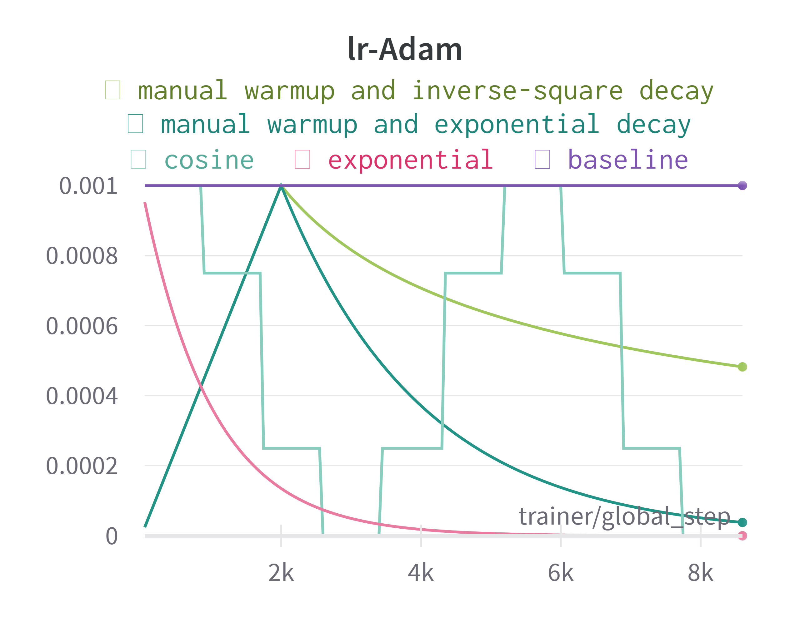

Here we consider four different learning rate control strategies:
- constant learning rate
- exponentially decay with training step
- cosine with training epoch
- manual warm up and decay using a lambda function

Their effects are illustrated in the following plot.

